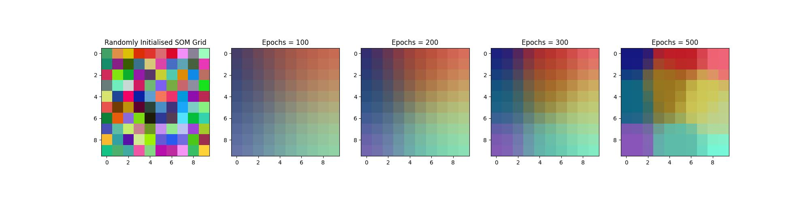
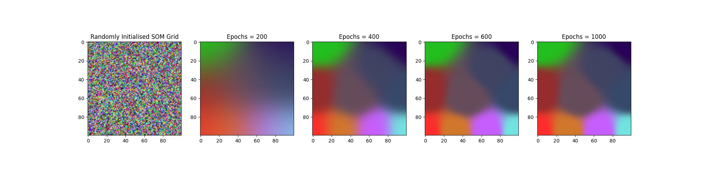

# SOM
- Basic numpy implementation of a kohonen self organising map (SOM)

# Kohonen network
The Kohonen Self Organizing Map (SOM) provides a data visualization technique which helps to understand high dimensional data by reducing the dimensions of data to a map. SOM also represents clustering concept by grouping similar data together.

Unlike other learning technique in neural networks, training a SOM requires no target vector. A SOM learns to classify the training data without any external supervision.


## Project Description
This project contains a basic implementation of a kohonen self organising map written in python using the numpy library and written using PEP8 standards. This library can be used by running the commands specified in the makefile and sending required parameters as a post request. This plot of the SOM at different iterations will be returned as a response and stored locally. A containerized running instance of the `som_library` has been deployed on GCP and instructions on how to use it has been outlined below. A continuous deployment workflow using github actions has also been included. 

## Some  outputs generated using the SOM library
- A 10x10 network trained for 500 iterations using 10 colours as input data. It takes about 4.7 seconds to train this network.



- A 100x100 network trained for 1000 iterations using 10 colours as input data. It takes 786.4 seconds to train this network.




## Files and folders in this repo
- `/.github/` folder: Contains github actions workflow. This workflow builds the docker image, pushes it to GCP artifact registry and container registry and then deploys the image on GCP cloud run. 

- `/logs/` folder: Contains output logs of locally running docker containers. The running time of the som training is also reported here. 

- `/som_plots/` folder: Contains output plots generated and python files on how to use the SOM library. 

- `Makefile`: Contains commands for building and running docker images locally. Also contains commands used to use local and cloud deployment. 

- `main.py`: main file run by uvicorn server to expose endpoint. 

- `requirements.py`: python libraries required by docker container

- `som_library.py`: Main python module for kohonen self oragnizing map. 

## How to use som_library locally 

- Clone this repo. 

- Run `make build` to build docker image

- Run `make run_som` to run local instance of built docker image. This exposes an endpoint that accepts requests.

- Run `make use_som_local` to check the performance of the SOM algorithm. Running this trains the network and returns a  `som.png` file as a response which will be stored in `som_plots` folder. Input parameters to the kohonen map  such as input data and map size can be set by changing desired parameters in `use_som_local.py` located in  `som_plots`. 
Parameters in `use_som_local.py` are specified as a dictionary as shown below. 

```
payload = {
    "input_data":training_data,
    "max_epochs": max_epochs,
    "map_size": map_size,
    "learning_rate": learning_rate
}
```
After changing parameters in `use_som_local.py`, run `make use_som_local` to get new plot file. 


## How to use endpoint deployed on GCP cloud run 

- Clone this repo. 

- [Optional] Run `make build` to build docker image. Artifact registry image has been made public and will be pulled when you run `make use_som_gcp`.

- Run `make use_som_gcp` to check the performance of the SOM algorithm. Running this trains the network online and returns a `som.png` file as a response which will be stored in `som_plots` folder. Input parameters to the kohonen map  such as input data and map size can be set by changing desired parameters in `use_som_gcp.py` located in  `som_plots`. Parameters in `use_som_gcp.py` are specified as a dictionary as shown below. 
```
payload = {
    "input_data":training_data,
    "max_epochs": max_epochs,
    "map_size": map_size,
    "learning_rate": learning_rate
}
```

 After changing parameters in `use_som_gcp.py`, run `make use_som_gcp` to get new plot file. 

